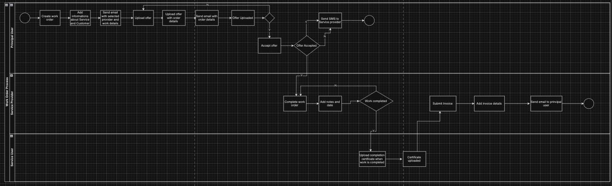

- Task 1: Modify the Workflow by Adding a New Step

The company has introduced a new requirement where the service provider must upload a "Completion Certificate" signed by the tenant
before submitting the invoice.
Your task is to add a new step called "UploadCompletionCertificate" between "CompleteWorkOrder" and "SubmitInvoice."
Ensure that this new step includes the following:
It must be a manual step.
It should be assigned to the "ServiceUser" role.
The user must upload the "CompletionCertificate" document.
Add appropriate "onEntry" and "onExit" events for this step.

ADDED:
New step UploadCompletionCertificate

- Task 2: Modify the Workflow by Adding a Condition

Add a condition that checks if the "CompletionCertificate" has been uploaded before allowing the submission of the invoice. Specifically:
Ensure that the "SubmitInvoice" step can only proceed if the "CompletionCertificate" has been uploaded in the
"UploadCompletionCertificate" step.
If the certificate is not uploaded, the user should be prompted to complete this step before moving forward.

ADDED:
SubmitInvoice condition into onEntry object

{
"eventName": "CompletionCertificateUploaded",
"condition": "(CompletionCertificate != null)"
}

- Task 3: Identify and Resolve Role-Related Issues in the JSON File

Review the JSON file and carefully examine each step to ensure that the role attribute is correctly assigned. Confirm that the role assigned to each step matches the intended user or group responsible for that action.

CHECKED: The role attributes are correctly

- Task 4: : Add Meaningful Attributes

Enhance the workflow by adding the following meaningful attributes:

Data Types: Specify the data types for each attribute (e.g., String, Decimal, Document).
Required Fields: Mark certain fields as required to ensure essential information is captured.
Default Values: Introduce default values for certain attributes, such as auto-generating IDs or timestamps.
Notifications: Add notifications for key events, ensuring that relevant parties are informed when certain steps are entered or completed.
Estimated Time: Add estimated times for each step to provide users with an idea of how long each task might take.

CHECKED:

DataType: Correct
Required Fields: Step UploadOffer -> modified OfferDocoment from false to true
Default Values: Step CreateWorkOrder -> added defaultValue = false for OfferNeeded attribute
Notifications: Added notifications for each step when certain steps are entered or completed
Estimated Time: Added estimated time for each

Task 5: : Visualize the Workflow

